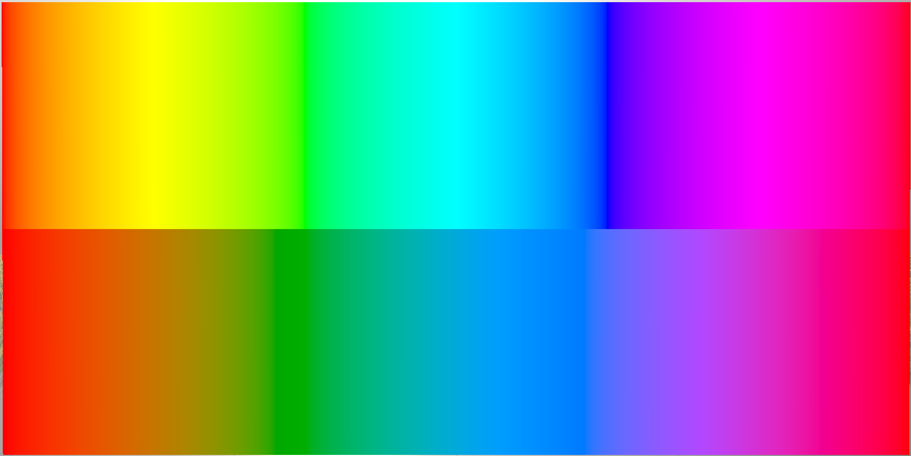

## An HLSL implementation of OKLAB

OKLAB is a perceptually uniform color space. That means that blending
between colors in OKLAB space produces more perceptually uniform gradients,
without weird transitional colors or changes in perceptual brightness or
saturation.


*Top: HSV gradient varying only hue; Bottom: OKLCH gradient varying only hue.*

The [original OKLAB blog post](https://bottosson.github.io/posts/oklab/)
explains its merits very well.

OKLAB [should be supported in Unity
2022](https://twitter.com/bjornornorn/status/1512428218892095496?lang=en), but
for us stuck on older versions, a library like this is necessary.

This code is *not* optimized. If using in a performance
critical setting, you should premultiply all matrices in your desired
transformation.

APIs provided:
```
float3 LRGBtoXYZ(float3 c);
float3 XYZtoLRGB(float3 c);

float3 XYZtoOKLAB(float3 c);
float3 OKLABtoXYZ(float3 c);

// Note: OKLCH hue is on the range [0, 2*PI], not [0, 1].
float3 OKLABtoOKLCH(float3 c);
float3 OKLCHtoOKLAB(float3 c);

// Everything below this line is unoptimized syntactic sugar.
float3 LRGBtoOKLAB(float3 c);
float3 OKLABtoLRGB(float3 c);

float3 LRGBtoOKLCH(float3 c);
float3 OKLCHtoLRGB(float3 c);
```

The gradient above was generated with this fragment shader:
```
fixed4 frag(v2f i) : SV_Target
{
  float4 albedo = 1;

  if (i.uv.y > 0.5) {
    // HSV gradient
    albedo.xyz = HSVtoRGB(float3(i.uv.x, 1.0, 1.0));
  } else {
    // OKLAB gradient
    float3 c0 = LRGBtoOKLCH(float3(1, 0, 0));
    c0.z += i.uv.x * 2 * 3.14159265;
    albedo.xyz = OKLCHtoLRGB(c0);
  }

  return albedo;
}
```

This content is released under the MIT license.
